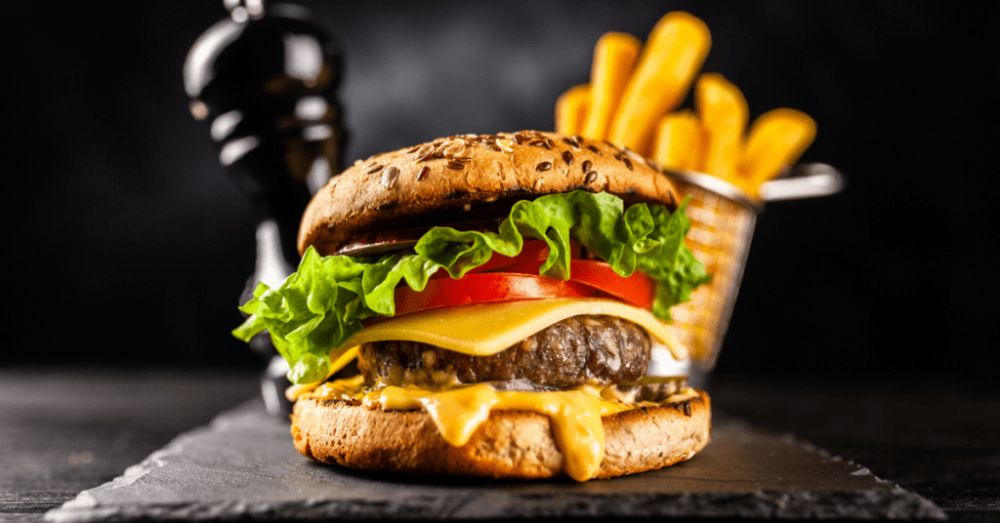
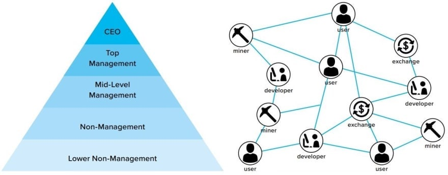

_Disclaimer: This article does not contain legal advice and is for educational purposes only._

This is the first part of a series of three articles, where we are going to set up and launch a DAO. This article will explore how a decentralized autonomous organization (DAO) can be utilized in a traditional business setting, such as a restaurant, and how it can be beneficial to customers, investors, and employees. 

As a DAO has no legal identity or limited liabilities, we'll be explaining why this structure is useful and how it works in practice.

In future articles, we will go through the technical process of setting up the DAO, launching the token, and using tools in the ecosystem to manage it.

## Introduction to DAOs 

DAOs are intended to replace the traditional business model of companies. In the old model, there is a hierarchical structure with a CEO in charge, and employees underneath him who are paid salaries, bonuses and commissions based on their performance. In the new DAO model, there are investors who buy tokens in exchange for ownership and receive dividends - in our case, $BURGER tokens - in exchange for providing liquidity to the business.

The difference between the two models is that in the DAO model, anyone can contribute to making money for the company without anyone's permission. You don't need permission to be a shareholder or an employee. You just need the ability to do work, which you can demonstrate through your work product. In this sense, it's closer to how open source projects work than how businesses work today.

This is basically an open-source business where anyone can submit a proposal for how much money they want and what they want to do with it. If enough people vote for it and it gets funded.

## Formation of the Burger DAO 

We'll be starting to get into a practical example of "Bob" who could benefit from a DAO. Bob wants to start a burger restaurant. Bob needs $200,000 to do it. 

Bob creates The BURGER DAO, a smart contract that facilitates the creation of a decentralized autonomous organization which creates and sells burgers. 

The contract will receive $200,000 in initial funding from Bob's $BURGER Token sale. These funds are managed collectively by the DAO in a treasury which will be used to fund operations, and provide initial liquidity for a $BURGER/USD LP pool.

The profitability of the DAO will drive future investment in additional real estate locations, equipment, food, and employees.

## The Burger Dao Token ( $BURGER ) 

Owning $BURGER token is a way of becoming both an investor/owner, as well as a customer of the DAO. It is a discount token that can be redeemed for burgers at any time. The more $BURGERS you have, the more burgers you can buy!

The market value of a burger at this point is $10 USD. The price of a burger is controlled by the DAO, and voted on by token holders who decide if they want a $5 burger or a $15 burger. The pricing of burgers is set in relation to the cost of operating staff ($20/hr) and ingredients ($5/lb). 

To order a burger from the restaurant, customers will have to buy $BURGER tokens on an exchange using USD (or another cryptocurrency of value). They then send $10 worth of $BURGER to a smart contract which will burn the tokens, and give them a receipt for their actual meal. This receipt can then be redeemed by someone at the restaurant who supplies them their meal, and scans their receipt as a form of "proof of service." This constant burning of tokens through purchases creates reliable sell pressure and apprecation on the $BURGER token as the business runs.

## Burger Corp

Wherever possible we will use $BURGER tokens to pay for expenses, as that can easily be managed by the DAO, but there are some real-world, or *legacy*, interactions that require a different approach. We'll need to rent a building for $10,000 and buy things for the restaurant like meat, buns, and knives. We also will need to order some tables and chairs; put advertisements in newspapers and on Facebook; buy an oven; hire people to work at the restaurant.

This calls for a Decentralized Autonomous Corporation (DAC) that will be controlled by our DAO. We'll call this "Burger Corp".

The process of setting up a DAC is the same as setting up a non-profit, or an LLC. The only difference between them is the bylaws of this corporation will be setup to respect the wishes of the DAO for all decisions related to the assets of the LLC. 

To sign the lease, The DAO will need to elect a treasurer who will manage certain real-world assets in the "Burger Corp". The treasurer will be mandated to sign off on contracts and capital expenditures only when mandated by a vote in the DAO. 

This structure allows for a legal 'person' to own assets, and sign contracts for the DAO, but still be following the will of the DAO.

The DAO will hold a vote on proposals, and if approved, transfer a portion of the USD held in it's treasury from the token sale to a specified address owned by the "Burger Corp" entity, enabling the treasurer to enter into a lease agreement with the storefront, pay for supplies, things we'll need for the building, and advertising for the restaurant.

We're in business now.

## Let's make BURGERS!

Now we have to hire some employees. We’ll start out paying $BURGERs to do work for the DAO. 

Initially, the DAO decides on setting compensation at 2 $BURGERs per hour, and will mint those $BURGER tokens as "Tracked hours" are completed.

Additionally, there can be incentivized rewards, such as 0.1 $BURGER for every order that was proven to be filled. Or task based rewards that the manager can set out, such as for cleaning the restaurant, cooking, or making deliveries.

The DAO may elect to hire a manager who will delegate work, and create these task based rewards. Their responsibilities will be to approve of work that meets the quality controls established by the DAO. The managers may revoke and 'fire' employees who are doing poor quality work. 

However, managers themselves are subject to the will of the DAO. A manager that is doing a poor job can trigger a vote of no confidence and be removed from their position, and starting a new election to fill their role. Customers will be asked to review their food from a mobile app and to file any complaints if found. Poor customer reviews on food assigned to a specific manager can cause that manager to have their rating to go down, and a low enough score can be grounds for removal.

## Selling burgers to generate value for the DAO

A patron named Joe has decided to work at the DAO restaurant. Joe works 8 hours a day and sells 10 orders an hour. Each order is for 1 $BURGER, which customers are purchasing for roughly $10 USD each. This would be adding roughly $100 USD an hour in liquidity to the DAO. 

Since Joe worked 40 hours that week, he added $4,000 USD to the DAOs liquidity pool and received 80 $BURGER in return (or $800 USD at current $BURGER prices).

The extra value added to the liquidity side above what employees receive in $BURGER will cause the $BURGER token to slowly be appreciating. This makes holding $BURGER an attractive investment for employees, investors, and customers, as they all benefit from this appreciation over time.

## Advantages of a DAO

This kind of business model has many benefits. The most obvious is that everyone who is involved in the project, including customers and investors, are financially incentivized to see the project succeed. Everyone is aligned with one common goal – the long term success of the organization.

In traditional businesses, there is a clear separation between employees and owners. In the DAO model, this separation disappears. Everyone has a say in how the company should function and how decisions should be made based on what they think will help achieve their shared goals.

The blockchain makes it easy for anyone to contribute to a business in meaningful ways. If you want to help make $BURGERs you can join in by offering your services as a cook or cashier or delivery rider or customer service agent or anything really.

All the users get to decide what products are made and sold by the DAO. They also get to decide where new locations will be opened up and what prices should be set for these products (this way, if customers think something is overpriced, they can vote for a change).

There are many reasons why people choose to work for the DAO, but one of the main reasons is that they can become an owner and have a larger stake in the votes that the business makes.

## The future is a decentralized world.

The Burger DAO is a great example of how a DAO works, and why it is beneficial for companies. Decentralized Autonomous Organizations have the potential to transform business culture.

This is just one example of how the DAO can be used. You can apply the same principles to any business or organization that can benefit from being decentralized.

Hopefully this post has given you some useful insight into how DAOs work and why they work so well. I will be releasing future posts in this series covering the smart contracts that can be used in this structure. If you are interested in learning more about DAO’s (or crypto development in general) don't forget to subscribe to the newsletter!

Thanks for reading! If you like this article, please share and join the discussion with your friends.