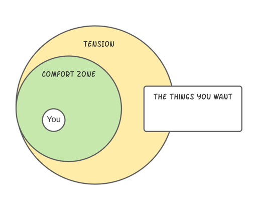
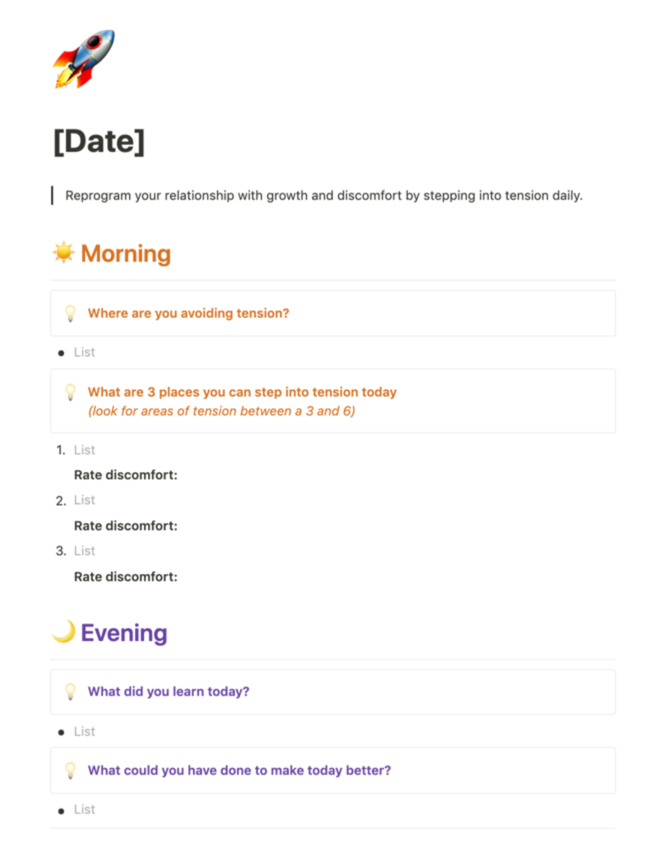

> I recently started a tension journal, and I'm finding it fascinating to see where in my life I'm growing.

In this article, I'll show you what Tension Journaling is, how it can help you, and I'll share the template that I created in Notion so you can get started.

## What is tension journaling?

Everything you want in life that you don't already have is outside your comfort zone.

It is natural for us to follow the patterns that make us feel comfortable. Some people have bad habits they want to change, like smoking, and they are uncomfortable breaking them. Others want things, a new job, partner, or starting their own business but the necessary discomfort keeps them where they are.

Only by stepping into tension can you expand your reality and get the things that you want out of life.     

Tension journaling helps answer the questions: **Where is my tension? Where am I avoiding conflict? What pain am I choosing to ignore?**

The practice of Tension Journaling is simple. Write down a few places in your life where you can step into a small level of discomfort and tension, and then follow through with action. Finally, reinforce those experiences by reflecting on what you learned later in the day.

## Why do you want to do tension journaling? (long term benefits)

What if you did things that made you a little nervous every day? You would grow each day from the amount of tension you'd taken on. 

Stepping into tension consistently is similar to lifting weights at the gym. If you lift weights that are too heavy, they might hurt your muscles. If you lift weights that are not heavy enough, your muscles don’t grow. If you lift the right amount of weight every day, your muscles grow bigger and stronger.

By staying consistent and stepping into the right level of tension in areas you want to grow, you can make huge changes in your life. 

You can learn more about the benefits of Tension Journaling [in this video by Brian Begin](https://www.youtube.com/watch?v=Fb1SNA7HJa0), who created the concept. 

## How should you start your journal entry?

Generally you want to avoid taking on something thats too high up on the tension scale. On a scale of 1 to 10, you want to choose things that are between a 3 and a 6.

The simple, daily process of stepping into lower levels of tension will create a habit that will motivate you to continue growing.

In the morning, write down 3 challenges that are at that level of tension, and then follow through on them during the day.

In the evening, journal the insights you have each day, and then spend 5 min before bed reflecting on your learnings that day.

## My Template for creating a tension journal on Notion

I’m a big fan of [Notion](www.notion.so). I’ve been using it for 6 months now, and it’s become the go-to software for all my projects, notes, and ideas.

[This template in Notion](https://tyhenkel.notion.site/Tension-Journal-8ab807921e9345d794de0649b06d7ce5) is what I've been using for my tension journal.

.

If you have Notion downloaded, all you need to do is click the "duplicate" button in the top right, and it will make a local copy that you can edit and use.

## Tension journaling is a way to level up your life

These past few weeks, I've had the chance to take on a huge amount of tension in my life, and I'm going to continue. It has already made a huge impact on my life.

The most successful people in life are the ones who experience the most tension. CEOs, top athletes, musicians. By practicing finding areas in our life where we can experience more tension, and becoming aware of areas that we're avoiding, we can begin creating a fuller and richer life.

Tension is not something to be avoided, but something to be embraced. Embrace the tension you're facing in life and watch how your life changes for the better.