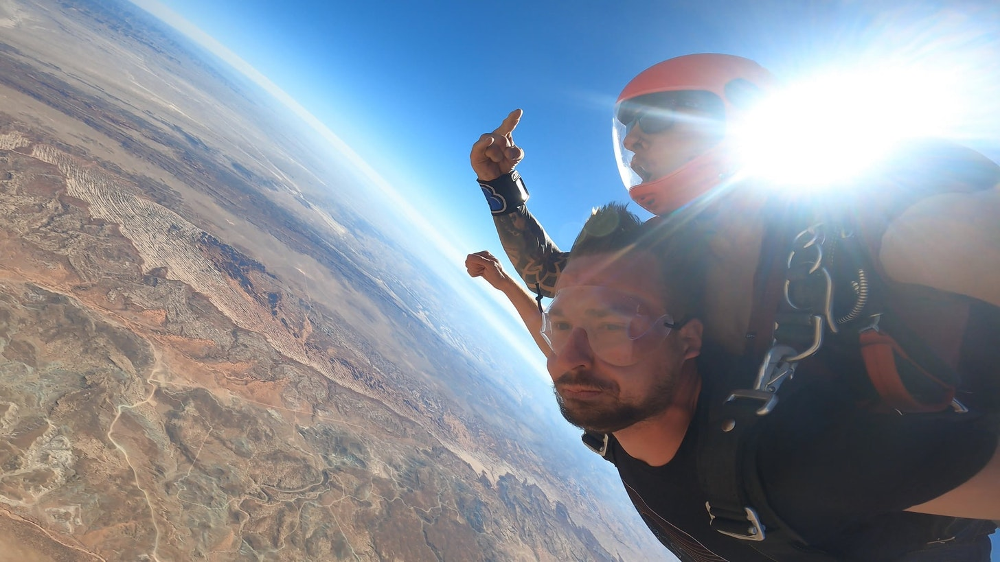
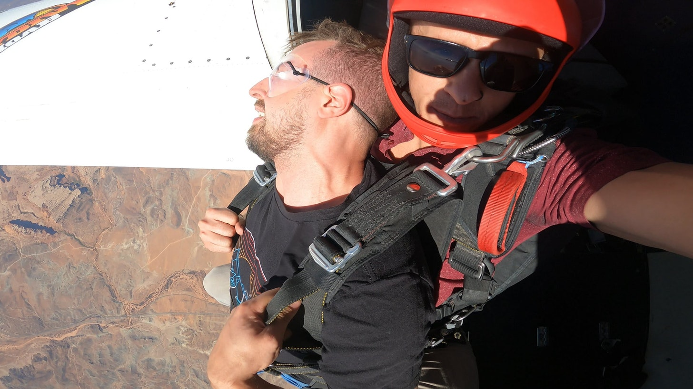

.

## The Idea

I went camping with friends this weekend. We were driving to our campsite and passed an airport for skydiving. One of my friends joked that we should jump out of a plane. I said, "I'd actually do that." His tone changed and he got serious. He said "I'm not joking, I'd really do it". I said "I would too." I thought to myself, maybe this is the time to do it. We agreed we'd try to call them the next day and see if we could arrange it.

We got to our campsite, and later that night told some of our friends what we were thinking of doing. They got excited and said they wanted to come. We now had a group of five.

The next day as we're getting lunch, one of our friends pulls up the website and fills in the reservation. He asks the table "Are we doing this?" we all say yes, and he clicks confirm on the deposit. 

At that moment the feeling hit me. All the tension hit my stomach. I felt like I didn't want to eat. I started gazing into the distance, going into my head. I tried grounding, but at this point, it was easier for me to ignore the feeling and I just pushed it out of my mind till later.

## Day of the jump

The next day we got up early to go to the airport. I prepared for the jump without thinking too much about it. When we got to the airport, I started to feel calm and a little excited. It looked professional and that put my mind at ease. 

I met my instructor and he told me some basics about how I should position myself during the jump. He said one thing that stuck with me "The answer to every question you have is, everything is fine, you're overthinking it."

It wasn't until we were walking to the airplane that I felt my nerves again. I started thinking of questions I had... Do I stay in this position the whole time? When do I put on my goggles? When do I take off my goggles? 

I was about to ask a question about the goggles and my instructor told me "Remember, everything is fine, you're overthinking it." We climbed down up the ladder and down the narrow tunnel into the back of the airplane. As we were taking off I was feeling tension move through different parts of my body. The instructor laughed to himself and said "Everyone always asks about the goggles..." He continued "It's the one thing they feel like they can control, they always overthink it."

He tells me "You're probably wondering why I haven't told you more instructions." He was right, the thought had crossed my mind. He said "It's called the primacy and recency bias. You're only going to remember the first thing I tell you, and the last thing. If I tell you anything more, you're going to get in you're head thinking about it. Just focus on staying out of your head, and stay present"

## Did it open?

There were a couple of guys in wingsuits in front of us. One of them opens the door to the plane and immediately jumps out. "Did it open...? Did it open?" someone asks. "It didn't open" someone replied. "Nope, didn't open." someone else says. I'm thinking there's no way. They're fucking with me, of course it opened... My instructor starts laughing loudly. They all start laughing. I'm getting more nervous now, what the hell is going on?

My instructor tells me "Okay, let me tell you the backstory. So the guy that just jumped got a new parachute. He tried it last week and it didn't deploy. He replaced it and got a brand new one of the same kind, and it also didn't deploy. We're all laughing because the odds of that happening are astronomically low." I was thinking, well shit. That's not what you want to hear as you're getting ready to jump out of an airplane. 

## Getting pushed

One by one, each tandem jumper ahead of us jumped out of the plane. Until it was just us. We slide to the door. I leaned my head out and could feel a huge amount of air pressure hitting my face. I looked down and hung my legs on the outside of the door. It looked like any view from the airplanes I've flown commercially, but this time there was nothing in between me and it.

He yells "Pizza", the code word for me to reposition my body for the jump. I do, and before I know it, I'm falling out of the plane. The G's hit me fast. I flip over and see the plane getting smaller and smaller. I'm accelerating extremely fast. I look down to see nothing but the earth below me. 

At this moment, as I'm speeding towards the earth near terminal velocity, I felt resigned to the fact that if the parachute doesn't open, I'm dead. Maybe I just killed myself. Well... I might as well enjoy the last moments I have, and start screaming out for joy, and taking in what I can.

After what felt like minutes of falling, the parachute opens up. My body felt so much relief. I yelled "I'm alive". 

It was so calm now... I just looked at the view below us. I was feeling amazed that there's nothing below my feet and enjoyed the view as much as I could as we slowly descended back to the earth. 

We landed softly back at the airport, and I've never felt so grateful to be alive. In the end, none of the questions I had actually mattered. Everything was fine and I was overthinking it.
